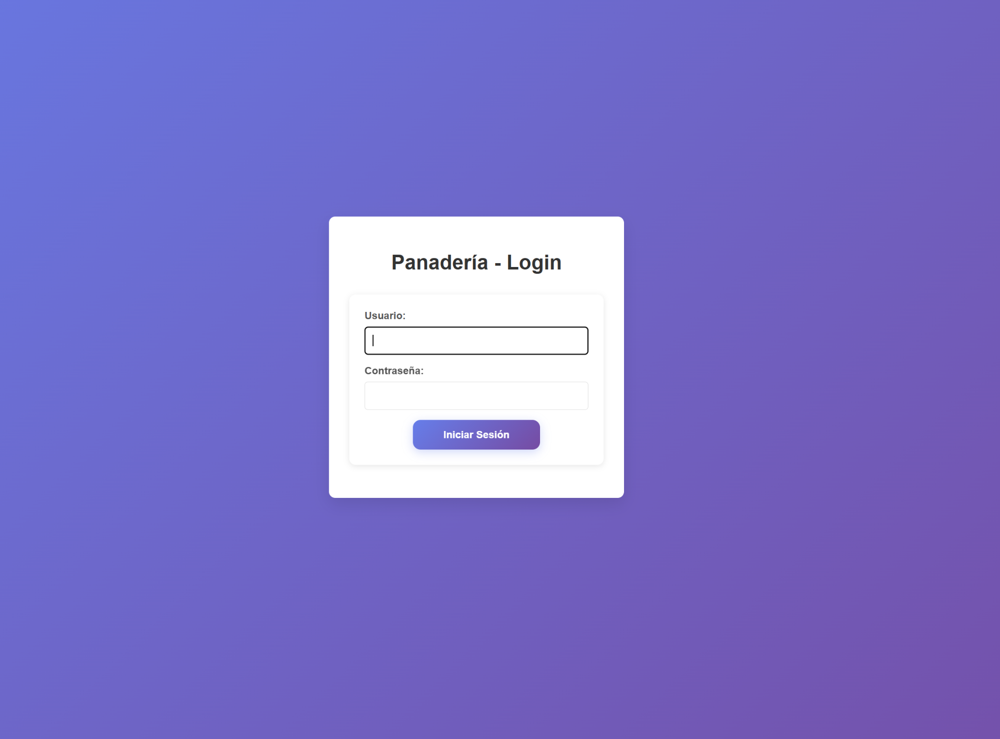
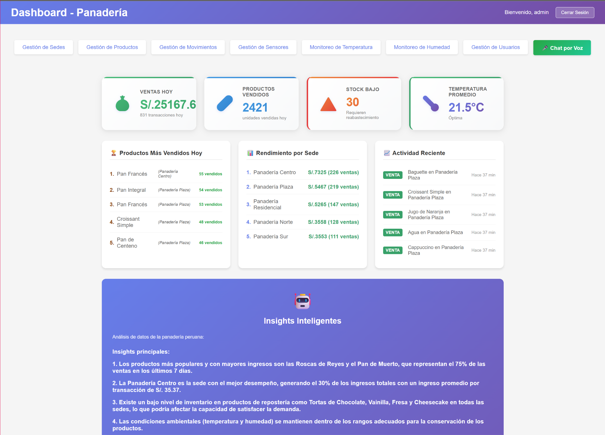
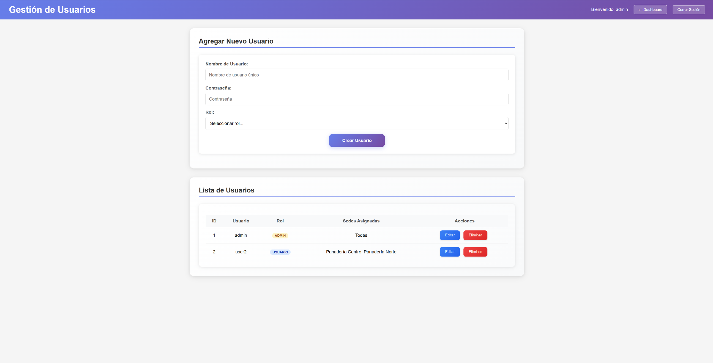
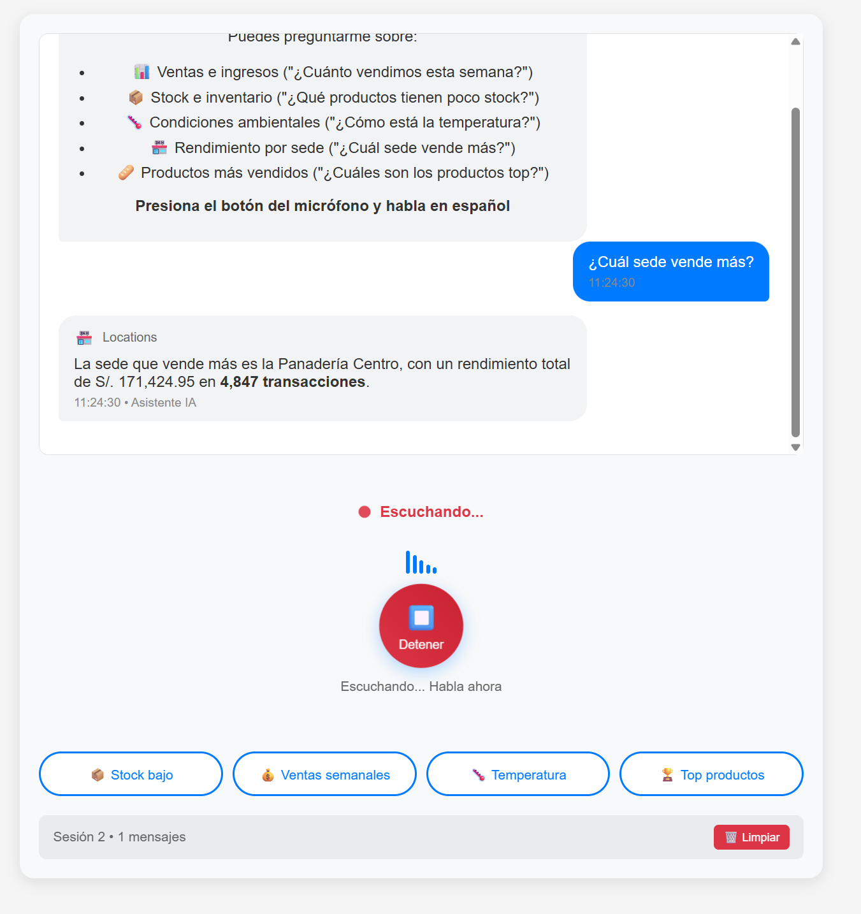
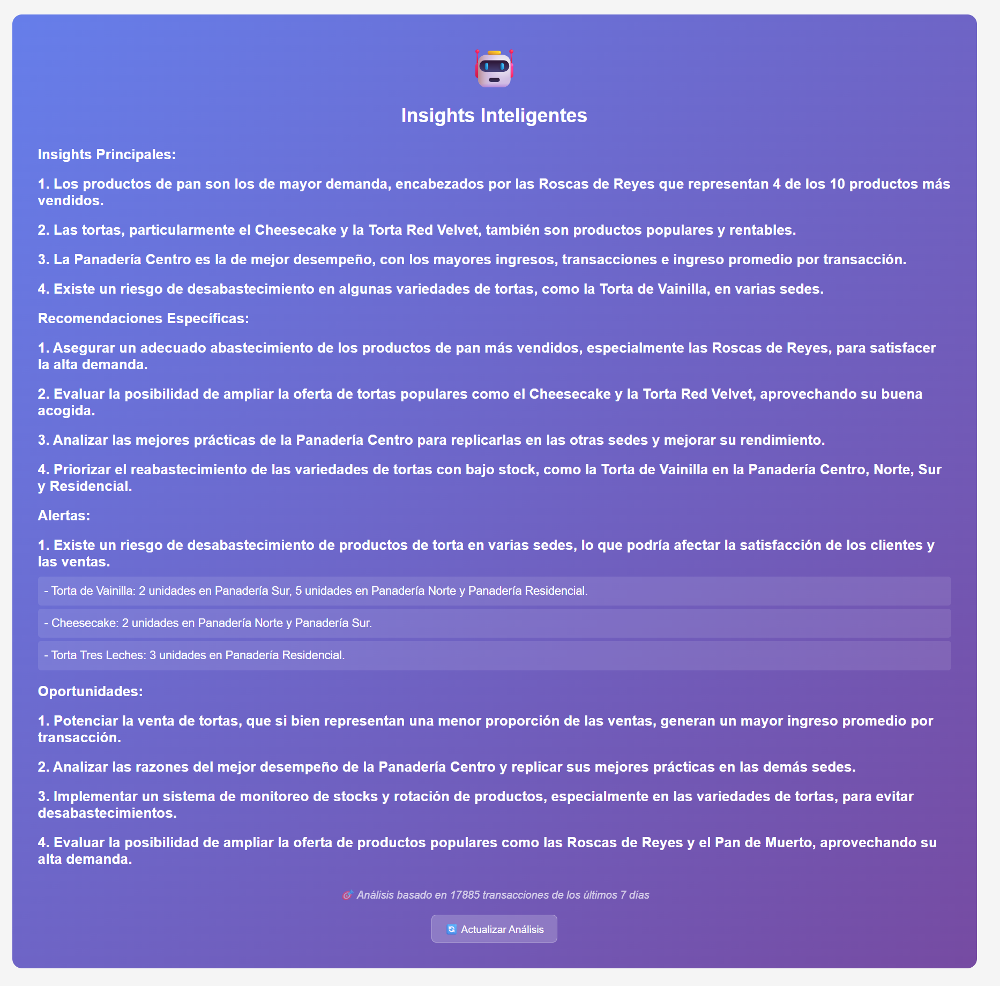
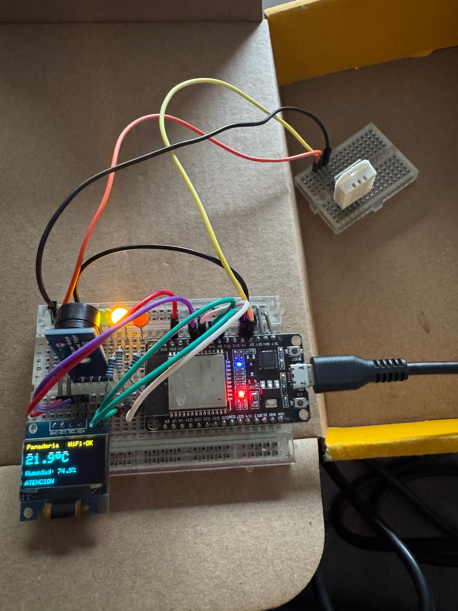
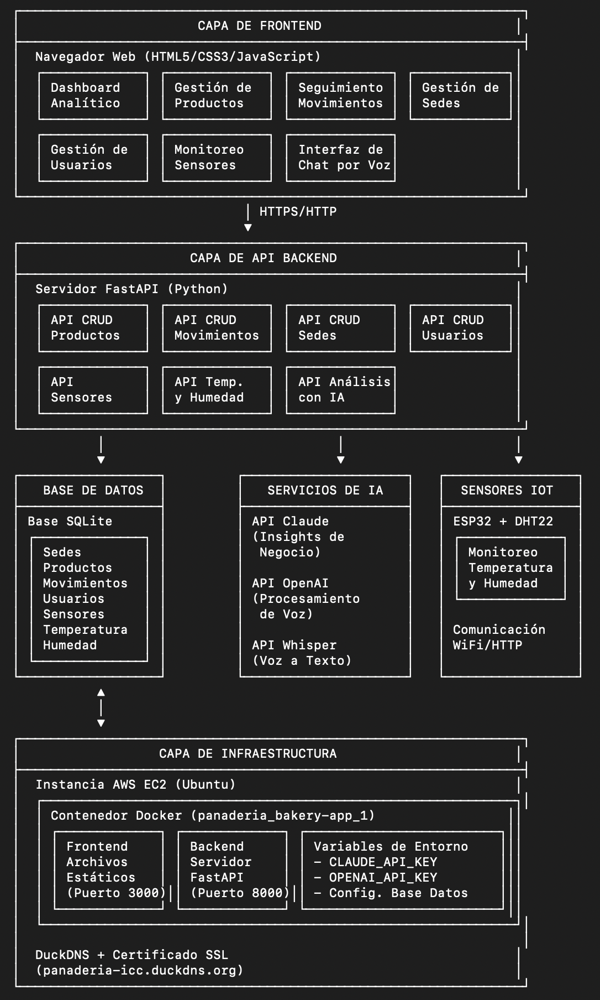

# 🍞 Sistema de Gestión de Panadería

     

Un sistema completo de gestión para múltiples panaderías con autenticación basada en roles, IoT sensor integration, AI-powered analytics, y control de acceso por sede.

## 📸 Demo / Capturas

_(Capturas reales del sistema, extraídas del informe final del curso — ver `docs/screenshots/`)_

| | |
|---|---|
|  |  |
| Login | Dashboard con KPIs |
|  |  |
| Gestión de usuarios | Asistente IA por voz (Whisper + GPT) |
|  |  |
| Insights inteligentes | Sensores IoT (ESP32 + DHT22) armados en protoboard |

**Arquitectura del sistema:**



## 🛠️ Stack Técnico

- **Backend**: FastAPI + SQLAlchemy + SQLite
- **Frontend**: HTML5 + CSS3 + Vanilla JavaScript
- **AI**: Claude (Anthropic), OpenAI API integration
- **IoT**: ESP32 + Arduino + DHT22 sensors
- **Analytics**: Real-time dashboard con AI insights

## 🚀 Inicio Rápido

### Requisitos Previos
- Python 3.8+
- SQLite3
- Navegador web moderno

### Clonar el Repositorio

```bash
git clone https://github.com/alvaro-oliveros/Panaderia.git
cd Panaderia
```

### Configuración de Variables de Entorno

El sistema soporta configuración via variables de entorno para diferentes despliegues:

#### Variables Principales
```bash
# Configuración del servidor
HOST=127.0.0.1                                    # Host del servidor backend
PORT=8000                                         # Puerto del servidor backend
DATABASE_URL=sqlite:///./panaderia.db            # URL de la base de datos
CORS_ORIGINS=http://localhost:3000,http://127.0.0.1:3000  # Orígenes permitidos para CORS

# Para funciones AI (opcional)
CLAUDE_API_KEY=your-claude-api-key-here          # API key de Claude

# Para Chat por Voz (requerido)
OPENAI_API_KEY=your-openai-api-key-here          # API key de OpenAI para Whisper y GPT
```

#### Configuración para Desarrollo Local (por defecto)
```bash
# No requiere configuración adicional, usa valores por defecto
./start.sh
```

#### Configuración para Despliegue en EC2/Docker
```bash
# Crear archivo .env con configuración de producción
cat > .env << EOF
HOST=0.0.0.0
PORT=8000
DATABASE_URL=sqlite:///./panaderia.db
CORS_ORIGINS=http://your-ec2-public-ip:3000
CLAUDE_API_KEY=your-claude-api-key-here
OPENAI_API_KEY=your-openai-api-key-here
EOF

# Iniciar con variables de entorno
./start.sh
```

#### Configuración Automática del Frontend
El frontend detecta automáticamente el entorno:
- **Local**: Usa `http://127.0.0.1:8000` como API URL
- **EC2/Producción**: Usa `http://{hostname}:8000` como API URL

No se requiere configuración manual del frontend para diferentes entornos.

### Opción 1: Inicio Automático (Recomendado)

**Linux/Mac:**
```bash
cd Panaderia
./start.sh
```

**Windows:**
```cmd
cd Panaderia
start.bat
```

El script automáticamente:
- ✅ Crea el entorno virtual
- ✅ Instala las dependencias
- ✅ Inicia ambos servidores
- ✅ Muestra las URLs de acceso

### Opción 2: Inicio Manual

1. **Configurar el backend**
   ```bash
   cd backend
   python -m venv venv
   source venv/bin/activate  # En Windows: venv\Scripts\activate
   
   # Dependencias básicas
   pip install fastapi uvicorn sqlalchemy
   
   # Dependencias para chat por voz (opcional)
   pip install openai python-multipart pydub
   ```

2. **Terminal 1 - Servidor backend**
   ```bash
   cd backend
   uvicorn app.main:app --reload --host 127.0.0.1 --port 8000
   ```

3. **Terminal 2 - Servidor frontend**
   ```bash
   cd Panaderia
   python3 -m http.server 3000 --directory frontend
   ```

### Acceso a la Aplicación
- **Frontend**: http://localhost:3000/login.html
- **Backend API**: http://localhost:8000
- **Documentación API**: http://localhost:8000/docs
- **Health Check**: http://localhost:8000/health
- **Dashboard**: http://localhost:3000/index.html (después del login)
- **Sensores**: http://localhost:3000/sensores.html
- **Temperatura**: http://localhost:3000/temperatura.html
- **Humedad**: http://localhost:3000/humedad.html
- **🎤 Chat por Voz**: http://localhost:3000/voice-chat.html

## 👥 Acceso al Sistema

### Administrador
- **Usuario:** `admin`
- **Contraseña:** `admin123`
- **Tipo:** Seleccionar "Administrador"

**Permisos del administrador:**
- Ver y gestionar todas las sedes
- Ver todos los productos y movimientos de todas las sedes
- Crear, editar y eliminar usuarios
- Asignar usuarios a múltiples sedes
- Acceso completo a todas las funcionalidades

### Usuario Regular
- **Usuario:** `user2`
- **Contraseña:** `user2`
- **Tipo:** Seleccionar "Panadería Centro"

**Permisos del usuario regular:**
- Solo ve productos y movimientos de sus sedes asignadas
- No puede gestionar sedes ni usuarios
- Puede agregar productos y movimientos solo a sus sedes asignadas

> Estas credenciales son datos de demostración locales, pensadas solo para probar el sistema en desarrollo.

## 🏗️ Estructura del Sistema

### Backend (FastAPI)
```
backend/
├── app/
│   ├── models.py       # Modelos de base de datos
│   ├── schemas.py      # Esquemas de validación
│   ├── database.py     # Configuración de BD
│   ├── main.py         # Aplicación principal
│   ├── config.py       # Configuración de variables de entorno
│   └── routes/         # Endpoints de la API
│       ├── productos.py
│       ├── sedes.py
│       ├── movimientos.py
│       ├── usuarios.py
│       ├── sensores.py     # CRUD de sensores IoT
│       ├── temperatura.py  # Lecturas de temperatura
│       ├── humedad.py      # Lecturas de humedad
│       ├── ai_analytics.py # Insights con IA (Claude)
│       └── voice_chat.py   # Chat por voz (Whisper + GPT)
└── panaderia.db        # Base de datos SQLite
```

### Frontend (HTML/CSS/JS)
```
frontend/
├── login.html          # Página de inicio de sesión
├── index.html          # Dashboard principal
├── productos.html      # Gestión de productos
├── sedes.html          # Gestión de sedes (solo admin)
├── movimientos.html    # Gestión de movimientos
├── usuarios.html       # Gestión de usuarios (solo admin)
├── voice-chat.html     # Chat por voz con IA
├── css/
│   ├── style.css       # Estilos del sistema
│   └── voice-chat.css  # Estilos específicos del chat por voz
└── js/
    ├── api.js          # Configuración de API
    ├── login.js        # Lógica de autenticación
    ├── dashboard.js    # Lógica del dashboard
    └── voice-chat.js   # Funcionalidad del chat por voz
```

## 📊 Funcionalidades Principales

### 1. **Gestión de Productos**
- ✅ Crear nuevos productos con información completa
- ✅ Ver lista de productos con **paginación** (50 productos por página)
- ✅ Editar y eliminar productos
- ✅ Categorización por tipo (pan, pasteles, galletas, bebidas, otros)
- ✅ Control de stock e inventario
- ✅ Asignación por sede
- ✅ **Alertas de stock bajo** automáticas

### 2. **Gestión de Movimientos**
- ✅ Registrar entradas y salidas de productos
- ✅ Seguimiento de inventario en tiempo real
- ✅ Filtrado por sede del usuario
- ✅ Historial completo de transacciones
- ✅ Vinculación automática con productos y sedes

### 3. **Gestión de Sedes** (Solo Administradores)
- ✅ Crear y gestionar múltiples panaderías
- ✅ Información completa de ubicación
- ✅ Asignación de usuarios a sedes específicas

### 4. **Gestión de Usuarios** (Solo Administradores)
- ✅ Crear usuarios con roles específicos
- ✅ Asignación múltiple de sedes por usuario
- ✅ Control de acceso basado en roles
- ✅ Gestión de contraseñas
- ✅ Interface de checkbox para asignación de sedes

### 5. **Dashboard Interactivo**
- ✅ Vista tabular organizada con navegación por pestañas
- ✅ Una tabla visible a la vez para mejor usabilidad
- ✅ Datos filtrados según permisos del usuario
- ✅ Navegación intuitiva entre módulos (Sedes, Productos, Movimientos)
- ✅ Información de sesión y usuario activo
- ✅ Ocultación automática de pestañas según rol de usuario
- ✅ **Analytics en tiempo real** (ventas hoy, productos vendidos, etc.)

### 6. **🤖 AI Analytics (Claude-powered)**
- ✅ **Insights inteligentes** sobre patrones de venta
- ✅ **Recomendaciones automáticas** para optimización
- ✅ **Análisis de performance** por sede
- ✅ **Modo mock** para testing sin consumir créditos
- ✅ **Dashboard en tiempo real** con métricas AI

### 7. **🌡️ IoT Sensor Integration**
- ✅ **Monitoreo de temperatura y humedad** en tiempo real
- ✅ **ESP32 support** con código Arduino incluido
- ✅ **Sistema de alertas** visual y sonoro
- ✅ **Dashboard de sensores** con histórico
- ✅ **Alertas automáticas** para condiciones críticas

### 8. **🎤 Speech-to-Text AI Chatbot**
- ✅ **Reconocimiento de voz en español** con OpenAI Whisper
- ✅ **Chat inteligente** con respuestas contextuales sobre el negocio
- ✅ **Consultas por voz** sobre ventas, inventario y condiciones ambientales
- ✅ **Interface conversacional** con historial de sesiones
- ✅ **Comandos rápidos** para consultas frecuentes
- ✅ **Integración completa** con base de datos en tiempo real

#### Comandos de Voz Soportados
**📊 Consultas de Ventas:**
- "¿Cuánto vendimos hoy?"
- "¿Cuáles son los ingresos de esta semana?"
- "¿Qué sede está vendiendo más?"

**📦 Gestión de Inventario:**
- "¿Qué productos tienen poco stock?"
- "¿Cuánto pan queda en inventario?"
- "¿Cuáles son los productos más vendidos?"

**🌡️ Condiciones Ambientales:**
- "¿Cómo está la temperatura?"
- "¿Hay alguna alerta ambiental?"
- "¿Cuál es la humedad actual?"

**🏪 Información General:**
- "¿Cómo va el negocio?"
- "¿Cuántas transacciones tuvimos?"
- "Dame un resumen del día"

#### Características Técnicas
- **Tecnología**: OpenAI Whisper (transcripción) + GPT-4 (respuestas)
- **Idioma**: Optimizado para español
- **Tiempo de respuesta**: < 3 segundos promedio
- **Precisión**: >90% en reconocimiento de voz
- **Contexto dinámico**: Incluye datos actuales del negocio
- **Historial**: Sesiones completas guardadas en base de datos

## 🔐 Sistema de Autenticación

### Tipos de Usuario

1. **Administrador (`admin`)**
   - Acceso completo al sistema
   - Ve todos los datos de todas las sedes
   - Puede gestionar usuarios y sedes
   - Sin restricciones de acceso

2. **Usuario Regular (`usuario`)**
   - Acceso limitado a sedes asignadas
   - Solo ve productos y movimientos de sus sedes
   - No puede gestionar usuarios ni crear sedes
   - Interface adaptada según permisos

### Control de Acceso por Sede
- Los usuarios regulares pueden ser asignados a múltiples sedes
- El sistema filtra automáticamente la información mostrada
- Los formularios solo muestran opciones disponibles para el usuario
- Validación tanto en frontend como backend

## 🗄️ Base de Datos

### Tablas Principales
- **Usuarios**: Información de usuarios y roles
- **Sedes**: Datos de las panaderías
- **Productos**: Inventario de productos
- **Movimientos**: Historial de entradas/salidas
- **UsuarioSedes**: Relación muchos-a-muchos entre usuarios y sedes

## 🛠️ API Endpoints

### Productos
- `GET /productos/` - Listar productos (con filtro opcional por user_id)
- `POST /productos/` - Crear producto
- `PUT /productos/{id}` - Actualizar producto
- `DELETE /productos/{id}` - Eliminar producto

### Movimientos
- `GET /movimientos/` - Listar movimientos (con filtro opcional por user_id)
- `POST /movimientos/` - Crear movimiento
- `PUT /movimientos/{id}` - Actualizar movimiento
- `DELETE /movimientos/{id}` - Eliminar movimiento

### Sedes
- `GET /sedes/` - Listar sedes
- `POST /sedes/` - Crear sede
- `PUT /sedes/{id}` - Actualizar sede
- `DELETE /sedes/{id}` - Eliminar sede

### Usuarios
- `GET /usuarios/` - Listar usuarios
- `POST /usuarios/` - Crear usuario
- `POST /usuarios/login` - Autenticación
- `PUT /usuarios/{id}` - Actualizar usuario
- `DELETE /usuarios/{id}` - Eliminar usuario

### Chat por Voz
- `POST /voice/transcribe` - Transcribir audio a texto (Whisper API)
- `POST /voice/query` - Procesar consulta de texto con IA
- `POST /voice/chat` - Workflow completo: audio → transcripción → respuesta IA
- `GET /voice/history/{session_id}` - Obtener historial de conversación
- `GET /voice/sessions/{user_id}` - Listar sesiones de chat del usuario
- `POST /voice/sessions/{session_id}/close` - Cerrar sesión de chat

### Sensores IoT
- `POST /sensores/` · `GET /sensores/` · `GET /sensores/{id}` · `PUT /sensores/{id}` · `DELETE /sensores/{id}` - CRUD de sensores
- `POST /temperatura/` · `GET /temperatura/` · `GET /temperatura/{id}` · `PUT /temperatura/{id}` · `DELETE /temperatura/{id}` - Lecturas de temperatura
- `POST /humedad/` · `GET /humedad/` · `GET /humedad/{id}` · `PUT /humedad/{id}` · `DELETE /humedad/{id}` - Lecturas de humedad

### AI Analytics
- `GET /ai/business-insights` - Insights generales del negocio
- `GET /ai/product-analysis/{product_id}` - Análisis de un producto específico
- `GET /ai/daily-summary` - Resumen diario generado con IA

## 🎯 Casos de Uso

### Escenario 1: Administrador
1. Inicia sesión como admin
2. Ve dashboard con todos los datos del sistema
3. Gestiona usuarios asignándolos a sedes específicas
4. Supervisa operaciones de todas las panaderías

### Escenario 2: Usuario de Panadería
1. Inicia sesión como usuario regular
2. Ve solo productos y movimientos de sus sedes asignadas
3. Registra nuevos productos para sus sedes
4. Controla entradas y salidas de inventario

### Escenario 3: Consulta por Voz
1. Accede al chat por voz desde el dashboard
2. Presiona el botón del micrófono y pregunta: "¿Cuánto pan vendimos hoy?"
3. El sistema transcribe la voz en español usando Whisper
4. IA analiza la consulta y responde con datos actuales del negocio
5. Puede continuar la conversación o usar botones de consulta rápida

## 🔧 Personalización

### Agregar Nuevas Categorías
Editar `productos.html` líneas 58-65 para agregar categorías:
```html
<option value="nueva_categoria">Nueva Categoría</option>
```

### Modificar Unidades de Medida
Editar `productos.html` líneas 46-53 para agregar unidades:
```html
<option value="nueva_unidad">Nueva Unidad</option>
```

## 📝 Datos de Prueba

El sistema incluye datos de ejemplo:
- 3 sedes: Centro, Norte, Sur
- 5 productos variados
- 5 movimientos de prueba
- Usuarios de ejemplo configurados

## 🐛 Resolución de Problemas

### Error de Conexión Backend
```bash
# Verificar que el servidor esté ejecutándose
curl http://127.0.0.1:8000/health

# Verificar endpoint específico
curl http://127.0.0.1:8000/sedes/
```

### Base de Datos Corrupta
```bash
# Eliminar y recrear la base de datos
rm backend/panaderia.db
# Reiniciar el servidor para recrear las tablas
```

### Problemas de CORS
- Asegurar que el frontend se sirva desde `http://127.0.0.1` o `localhost`
- Verificar configuración CORS en `backend/app/main.py`

## 🛡️ Seguridad y Preparación para GitHub

### Variables de Entorno Sensibles
✅ **API keys**: Configuradas via variables de entorno, no en código
✅ **Base de datos**: Excluida de git via .gitignore
✅ **Archivos de configuración**: .env y logs excluidos

### Archivo .gitignore Incluido
El proyecto incluye un `.gitignore` comprehensivo que excluye:
- Variables de entorno (.env)
- Base de datos (*.db)
- Entorno virtual de Python (venv/)
- Archivos de log y temporales
- API keys y secretos

### 🔐 Antes de Subir a GitHub:
1. ✅ **API keys removed**: No hay keys hardcoded en el código
2. ✅ **.gitignore created**: Archivos sensibles excluidos
3. ✅ **Environment setup**: Documentación de variables de entorno
4. ✅ **Sample data**: Solo datos de prueba, no información real

### 🌟 Características para GitHub:
- **README comprehensivo** con instrucciones de setup
- **Código limpio** sin información sensible
- **Documentación completa** de API endpoints
- **Instrucciones de IoT setup** incluidas
- **Guías de troubleshooting**

## 🚀 Despliegue y Configuración Avanzada

### Configuración para Diferentes Entornos

#### Desarrollo Local
```bash
# Usar configuración por defecto
./start.sh
```

#### Despliegue en EC2 con Docker
```bash
# 1. Crear archivo .env para producción
cat > .env << EOF
HOST=0.0.0.0
PORT=8000
DATABASE_URL=sqlite:///./panaderia.db
CORS_ORIGINS=http://$(curl -s http://169.254.169.254/latest/meta-data/public-ipv4):3000
EOF

# 2. Iniciar aplicación
./start.sh
```

#### Variables de Entorno Disponibles
- **HOST**: Dirección IP del servidor (default: 127.0.0.1)
- **PORT**: Puerto del servidor backend (default: 8000)  
- **DATABASE_URL**: URL de conexión a la base de datos
- **CORS_ORIGINS**: Orígenes permitidos para CORS (separados por comas)
- **CLAUDE_API_KEY**: API key para funciones AI (opcional)

#### Detección Automática de Entorno
El frontend detecta automáticamente el entorno de ejecución:
- **Local**: `http://127.0.0.1:8000`
- **EC2/Producción**: `http://{hostname}:8000`

#### Health Check
Endpoint disponible para monitoreo:
```bash
curl http://your-server:8000/health
# Respuesta: {"status": "healthy", "message": "Bakery API is running"}
```

### Archivos de Configuración

#### `.env.example`
Template de configuración incluido en el proyecto con valores por defecto y comentarios explicativos.

#### `backend/app/config.py`
Clase de configuración centralizada que maneja:
- Configuración del servidor
- Configuración de base de datos
- Configuración de CORS
- Detección automática de rutas absolutas para SQLite

## 📄 Licencia

Este proyecto no incluye actualmente un archivo de licencia. Si deseas que otros puedan reutilizar el código libremente, se sugiere licencia **MIT**.

---

**Para soporte técnico, revisar los logs del servidor backend y la consola del navegador para errores de frontend.**
